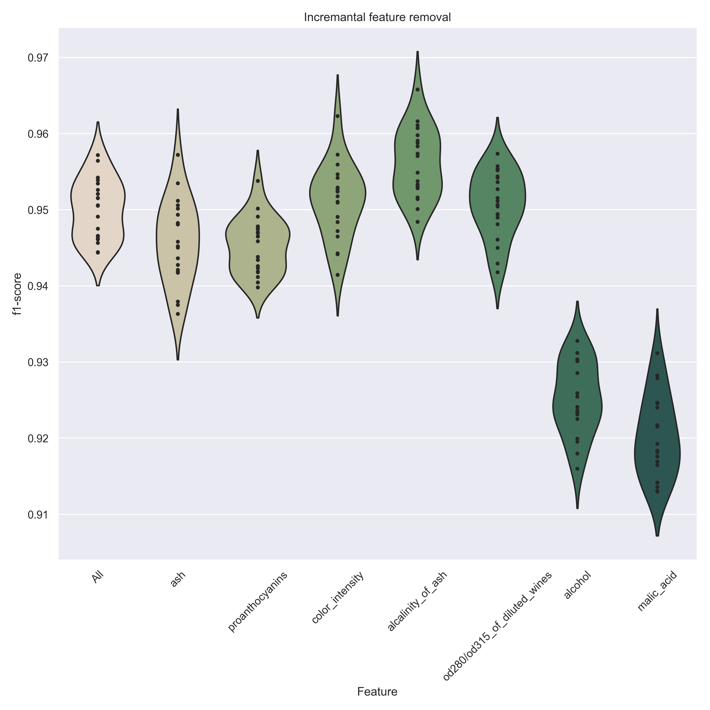
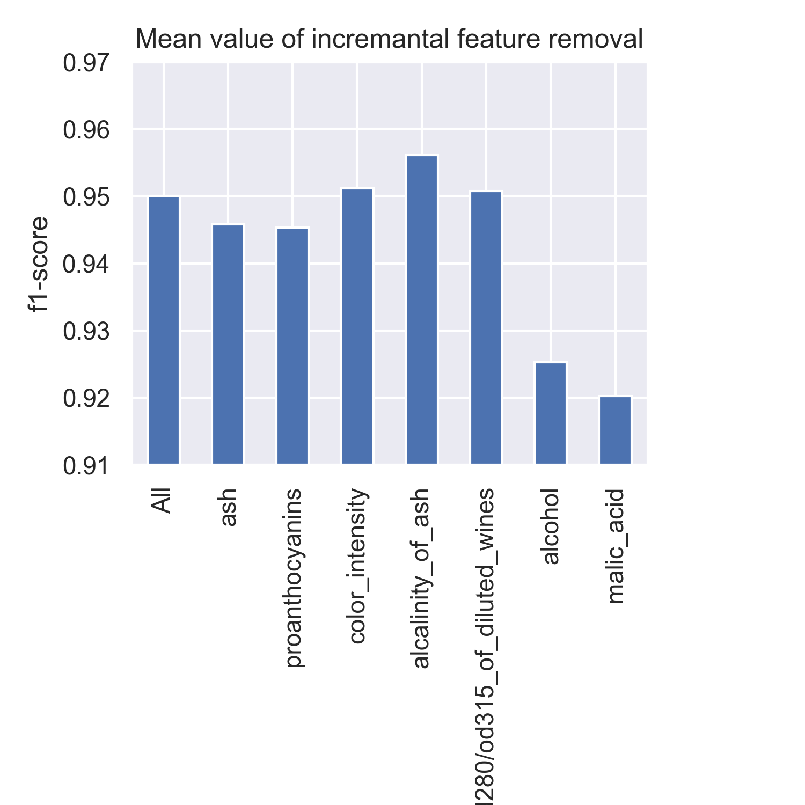
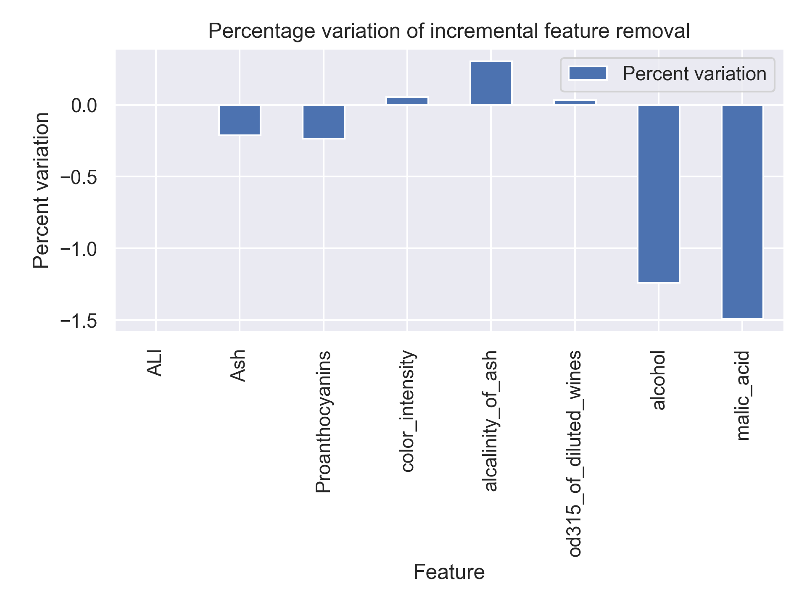

# Increasing Overall f1-score by removing features

| Name | Date |
|:-------|:---------------|
|Sebastien Church|December 1, 2019|

-----

### Resources
Your repository should include the following:

- Python script for your analysis: `project.py`
- Results figure/saved file:  `plots/`

-----

## Research Question

Can the removal (dropping) of features improve the performance of a dataset?

### Abstract

Using the Wine dataset we are trying to demonstrate that the removal of features can sometimes be useful when preparing a dataset.
By using this dataset and the SVC (linear) estimator we will try and demonstrate that this is possible.

### Introduction

The Wine dataset is from one of the sklearn dataset ([https://scikit-learn.org/stable/modules/generated/sklearn.datasets.load_wine.html](https://scikit-learn.org/stable/modules/generated/sklearn.datasets.load_wine.html)), form R.A. Fisher.
It is a classification dataset with 13 features and 3 classes with 178 samples.
The graphs used vary from histograms, correlation maps and violinplots.

### Methods

As mentioned the method used for modelling the data was sklearn SVC (linear) as seen in the top left of the following figure.
We will use the f1-score as the key indicator of performance for our evaluations.

The data points used in the evaluation of the model are based on 50 fitness tests for each features
There are 20 data points in each evaluated feature.
The initial methodology used was to do single removal of features and look at the results using a violin plot

As we can see there are some notable features that seem to increase performance such as proantocyanins, alcalinity_of_ash and magnesium.
And some that drastically reduces the performance such as proline.

The next step was to automate the feature selection and removal. We chose the correlation values as the base to select the features.
First we generated the correlation heat map.

Rather than trying to find out the best candidates directly from the heatmap, we wrote some algorithm to extract the candidate features.
We extracted the features based on a correlation score of between -0.05 and 0.05. Next we gave weight to the features based on the number of occurrence they appeared in the results.

Here are the correlations that were selected by the algorithm:

| Correlations |
|:-------|
| ash  and  proanthocyanins
| ash  and  od280/od315_of_diluted_wines
| alcalinity_of_ash  and  color_intensity
| proanthocyanins  and  color_intensity

This gave us the following results after the weight is applied

| Feature | Weight |
|:-------|:---------------|
| Ash | 2 |
| Proanthocyanins | 2 |
| color_intensity | 2 |
| alcalinity_of_ash | 1 |
| od315_of_diluted_wines | 1 |

All other features were at 0 weight.

We then proceeded to the systematic (incremental) removal of features in the dataset and measuring the performance using f1-score.

A dataframe was constructed with features, in this case 7 (5 of significance and 2 with weight of 0), filling the samples with the 20 values of fitness calculated.
For good measure the initial baseline with all features was inserted at position 0.

Here is a violinplot showing the results

As the plot shows there seems to be a increase in f1-score for the model by removing the selected features.

Further analysis indicates a positive increase in f1-score. The increase happens when we remove the following 4 features:
<b>Ash, proanthocyanins, color_intensity and alcalinity_of_ash.</b>

You can also observe the fi-score is highly affected by features not selected based on correlation. (alcohol, malic_acid)
 

### Results

Final analysis of the overall effects or feature removal can be seen in the following graph showing the percentage in variation for each feature removal.

We can clearly see an increase of 0.303435 percent in f1-score in regards to the 4 features that were removed. This can seem small but any improvement to the model will gain in accuracy.

Another observation is that the removal of all of the selected low correlated feature does not negatively impact the accuracy of the model.

This means that wines can be identified with less measurable features. Usefull when we are missing values for certain features.

### Discussion

The method used here does indicate that the removal of low correlated features increase the performance of the model.
It also proves that a feature set can be modified by the removal of features without affecting it's performance.

### References
None

-------